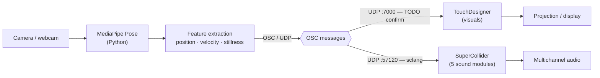

# Poor Things: Internal Collapse

> An interactive audiovisual installation in which a moving body becomes the unstable
> instrument of its own dissolution — read by a camera, sonified in real time, and
> slowly turned against itself until it comes apart.

**Poor Things: Internal Collapse** is a real-time installation at the intersection of
computer vision, spatial sound, and generative visuals. A single camera tracks the body
through **MediaPipe**; the resulting motion data is streamed over **OSC** into
**TouchDesigner** (image) and **SuperCollider** (sound), where five interlocking sound
processes translate presence and movement into a slow, structural collapse.

---

## Table of contents

- [Concept](#concept)
- [Architecture](#architecture)
- [Sound modules](#sound-modules)
- [Installation & running](#installation--running)
- [Repository structure](#repository-structure)
- [Technical requirements](#technical-requirements)
- [Documentation map](#documentation-map)
- [Credits](#credits)

---

## Concept

A single body enters the space. A camera watches it — not to recognise it, but to
measure it: the height of a hand, the lean of the spine, the speed of a turn, the moment
of stillness. That measurement is the only material the work has. From it, the
installation builds a sonic and visual organism that first mirrors the body and then,
gradually, begins to fail in front of it. *Internal Collapse* is the score of that
failure: the more the body asserts itself, the more the system it drives loses
coherence.

The work borrows its frame from *Poor Things* — the figure of an assembled, reanimated
creature, tender and unfinished, learning the limits of the form it has been given. Here
the "creature" is the audiovisual system itself, stitched together from five sound
processes that each model a different mode of breakdown: a spectrum eroding, a sound
field pulling itself apart, a voice fragmenting into grains, an endlessly falling tone
that never lands, and a feedback loop that feeds on its own loudness. None of these is a
metaphor laid on top of the sound; each *is* a way of collapsing, made audible.

There is no neutral place to stand. The participant does not observe the collapse from
outside — they cause it, and the system answers their movement with consequence. Holding
still does not stop the process; it only changes its direction. The piece asks what it
feels like to be the unstable centre of a system that mirrors you faithfully right up to
the point where it can no longer hold itself together.

---

## Architecture

The installation is a one-directional real-time pipeline: **camera → vision → OSC →
synthesis/rendering → light and sound.** Python does the seeing, OSC is the connective
tissue, and TouchDesigner and SuperCollider are the two output organs that consume the
same body data in parallel.

**Components**

- **MediaPipe (Python)** — reads the camera, runs pose tracking, and reduces the raw
  landmarks to a small set of expressive *features* (positions, distances, velocities,
  stillness). It is the only component that touches the camera.
- **OSC (Open Sound Control over UDP)** — the transport layer. Python broadcasts feature
  messages to both renderers; the two renderers never need to talk to the camera and can
  be started, stopped, or reloaded independently.
- **TouchDesigner** — receives OSC on an *OSC In* CHOP/DAT and maps the features to the
  visual system (projection / display).
- **SuperCollider** — receives OSC in `sclang` via `OSCdef`, and routes each address to
  the parameters of the five sound modules running on the audio server (`scsynth`).

### Data flow



<details>
<summary>Plain-text version of the diagram</summary>

```
                                   ┌───────────────────────────┐
                                   │  TouchDesigner (visuals)  │ ──▶ Projection / display
   Camera ─▶ MediaPipe ─▶ Feature  │   OSC In  ·  UDP :7000*   │
            (Python)     extract ──┤                           │
                          │   OSC  └───────────────────────────┘
                          │  (UDP) ┌───────────────────────────┐
                          └──────▶ │  SuperCollider (sound)    │ ──▶ Multichannel audio
                                   │   OSCdef  ·  UDP :57120   │
                                   │   5 SynthDef modules      │
                                   └───────────────────────────┘
            * TouchDesigner port is a placeholder — confirm in docs/osc-map.md
```

</details>

### OSC topology

Python sends each feature as an OSC message to **two destinations in parallel**:
SuperCollider's language port and TouchDesigner's OSC-In port. The authoritative list of
ports and addresses lives in **[`docs/osc-map.md`](docs/osc-map.md)** — treat that file
as the single source of truth and keep the synth/TD patches in sync with it.

| Stream | From | To | Default port | Notes |
|---|---|---|---|---|
| Body features → sound | Python | SuperCollider (`sclang`) | **57120** (UDP) | sclang's default OSC receive port; handled by `OSCdef`. |
| Body features → visuals | Python | TouchDesigner | **7000** (UDP) | _Placeholder_ — set to match your *OSC In* CHOP. **TODO: confirm.** |
| Internal audio server | `sclang` | `scsynth` | 57110 (UDP) | Internal to SuperCollider; not used by Python. |

> **Placeholder notice.** Port numbers and every OSC address in this repository are a
> proposed, conventional default. They are marked **TODO** so you can replace them with
> the real values from your patches. Update `docs/osc-map.md` first, then the synth and
> TD sides.

For a deeper description of feature extraction, message rates, and latency, see
**[`docs/architecture.md`](docs/architecture.md)**.

---

## Sound modules

The sound is built from **five SuperCollider `SynthDef` modules**. Each is an independent
voice with its own OSC namespace, and each models a different mode of *collapse*. The OSC
addresses below are a **proposed convention (placeholders)** — the canonical mapping is in
**[`docs/osc-map.md`](docs/osc-map.md)**; update both together.

### 1. Spectral Sculpture
Spectral-domain processing (FFT / `PV_` UGens) that carves, smears, and erodes the
frequency content of the source. This is the "material" of the piece — a body of sound
that can be blurred, frozen, and worn away as the participant moves.

| OSC address (placeholder) | Range | Driven by | Effect |
|---|---|---|---|
| `/sc/spectral/blur` | 0–1 | torso openness | spectral smearing / time-blur |
| `/sc/spectral/shift` | −1–1 | hand height | bin / frequency shift |
| `/sc/spectral/erode` | 0–1 | overall motion energy | magnitude erosion (loss of partials) |
| `/sc/spectral/freeze` | 0 / 1 | stillness | spectral freeze gate |
| `/sc/spectral/amp` | 0–1 | presence / proximity | module level |

### 2. Spatial Separation
Multichannel spatialisation that pulls the sound sources apart across the speaker field,
decorrelating and dislocating what was a single image. Models the loss of a coherent
"place" for the sound.

| OSC address (placeholder) | Range | Driven by | Effect |
|---|---|---|---|
| `/sc/spatial/x` | −1–1 | body centroid (horizontal) | azimuth / pan position |
| `/sc/spatial/y` | −1–1 | body depth / distance | front–back position |
| `/sc/spatial/spread` | 0–1 | arm span | source spread / decorrelation |
| `/sc/spatial/rotate` | 0–1 | angular velocity | rotation speed of the field |

### 3. Voice Glitch
Granular / buffer-stutter processing of a vocal sample — scrubbing, repeating, and
shattering the voice into grains. The most overtly "broken" voice in the set: language
reduced to texture.

| OSC address (placeholder) | Range | Driven by | Effect |
|---|---|---|---|
| `/sc/voice/scrub` | 0–1 | hand horizontal position | playback position in buffer |
| `/sc/voice/density` | 0–1 | motion energy | grain density |
| `/sc/voice/jitter` | 0–1 | acceleration / jerk | position & pitch jitter |
| `/sc/voice/pitch` | −12–12 | head height | grain transposition (semitones) |
| `/sc/voice/gate` | 0 / 1 | gesture trigger | stutter on/off |

### 4. Shepard Tone
An endless-glissando illusion: stacked octaves crossfading so the pitch seems to rise or
fall forever without arriving. The sound of collapse that never completes — perpetual
descent as a structural state.

| OSC address (placeholder) | Range | Driven by | Effect |
|---|---|---|---|
| `/sc/shepard/rate` | −1–1 | vertical velocity | glide direction & speed (down = descent) |
| `/sc/shepard/depth` | 0–1 | crouch / extension | number of active octaves |
| `/sc/shepard/tilt` | 0–1 | body lean | spectral tilt of the stack |
| `/sc/shepard/amp` | 0–1 | presence | module level |

### 5. Amplitude Feedback Loop
A self-exciting feedback path governed by an amplitude follower: the louder the system
gets, the more it feeds back. This is the engine of the "collapse" — a runaway process
held just below the edge by a safety ceiling.

| OSC address (placeholder) | Range | Driven by | Effect |
|---|---|---|---|
| `/sc/feedback/gain` | 0–1 | proximity to camera | feedback loop gain |
| `/sc/feedback/threshold` | 0–1 | stillness | amplitude threshold that opens the loop |
| `/sc/feedback/release` | 0–1 | motion energy | decay / how fast it settles |
| `/sc/feedback/ceiling` | 0–1 | manual (limiter) | hard safety ceiling — **set conservatively** |

> ⚠️ **Monitor safety.** The feedback module can build quickly. Always keep a hardware or
> software limiter on the master and start `ceiling` low. See the runbook in
> [`CONTRIBUTING.md`](CONTRIBUTING.md).

---

## Installation & running

### Prerequisites

| Software | Suggested version | Purpose |
|---|---|---|
| **SuperCollider** | 3.13+ _(TODO: confirm)_ | sound engine + the five SynthDef modules |
| **TouchDesigner** | 2023.30000+ _(TODO: confirm)_ | real-time visuals (non-commercial licence is fine for typical resolutions) |
| **Python** | 3.10+ _(TODO: confirm)_ | MediaPipe tracking + OSC sender |
| Python packages | `mediapipe`, `python-osc`, `opencv-python`, `numpy` | pin exact versions in [`mediapipe/requirements.txt`](mediapipe/) |

> Versions are suggested defaults — pin the ones you actually use before relying on this
> as a runbook.

### OSC ports

| From → To | Port | Where to set it |
|---|---|---|
| Python → SuperCollider | **57120** UDP | `sclang` default; in the Python sender config |
| Python → TouchDesigner | **7000** UDP _(TODO confirm)_ | the *OSC In* CHOP/DAT in the `.toe`, and the Python sender config |

Keep these identical in three places: the Python sender, the TD *OSC In* node, and
[`docs/osc-map.md`](docs/osc-map.md).

### Startup sequence

1. **SuperCollider** — open `supercollider/main.scd`. Boot the audio server, evaluate the
   five SynthDefs in `supercollider/synthdefs/`, then start the OSC responders in
   `supercollider/osc/`. Confirm in the post window that the responders are listening on
   `57120`.
2. **TouchDesigner** — open the project in `touchdesigner/`. Check that the *OSC In*
   CHOP/DAT port matches the value above.
3. **Python tracker** — from `mediapipe/`, activate your virtual environment and run the
   tracker (e.g. `python tracker.py`). It opens the camera and begins broadcasting OSC to
   both destinations.
4. **Verify** — move in front of the camera. You should see values changing on the SC post
   window / TD *OSC In* CHOP, and hear/see the system respond. If not, see the
   troubleshooting section in [`CONTRIBUTING.md`](CONTRIBUTING.md).

> The exact filenames and commands above describe the intended layout. The actual
> SuperCollider, TouchDesigner, and Python source files are **not yet committed** — this
> repository currently ships the documentation and structure. Drop your working files into
> the matching folders and the runbook will line up.

---

## Repository structure

```
poor-things-internal-collapse/
├── README.md                  ← you are here (concept + full overview)
├── CONTRIBUTING.md            ← runbook & notes-to-self: how to run it, gotchas, conventions
├── .gitignore
├── docs/
│   ├── architecture.md        ← detailed signal/data-flow description
│   ├── osc-map.md             ← AUTHORITATIVE OSC port + address reference (fill in)
│   └── diagrams/
│       └── dataflow.svg       ← portfolio-ready data-flow diagram
├── supercollider/             ← all SuperCollider sound code
│   ├── README.md
│   ├── main.scd               ← (expected) boot + load entry point
│   ├── synthdefs/             ← one .scd per sound module (5 total)
│   └── osc/                   ← OSCdef responders mapping addresses → synth params
├── touchdesigner/             ← TouchDesigner project + exports
│   ├── README.md
│   └── exports/               ← rendered stills/clips, exported TOX components
├── mediapipe/                 ← Python pose tracking + OSC sender
│   └── README.md              ← (expected) tracker.py, requirements.txt, config
└── media/                     ← portfolio media
    ├── README.md
    ├── stills/                ← documentation photographs
    ├── video/                 ← installation / process video (use Git LFS)
    └── audio/                 ← sound excerpts
```

Each top-level folder carries its own `README.md` describing exactly what belongs inside.

---

## Technical requirements

**Hardware**

- Camera: a webcam or capture device with a clear, evenly lit view of the participant.
- Computer: a GPU capable of running TouchDesigner at projection resolution; enough CPU
  headroom to run MediaPipe and SuperCollider alongside it. _(TODO: note your actual rig.)_
- Audio: a multichannel audio interface is recommended so **Spatial Separation** has a
  real speaker field to work with (stereo works as a reduced version).
- Output: projector or display for the visuals; a monitored, limiter-protected sound
  system for the audio.

**Software**

- SuperCollider, TouchDesigner, and Python as listed under [Prerequisites](#prerequisites).
- OSC over UDP on the local machine (or a quiet LAN); make sure the firewall allows the
  ports above.

**Operating system**

- Developed on _(TODO: macOS / Windows + version)_. MediaPipe and python-osc are
  cross-platform; TouchDesigner runs on macOS and Windows. Note any OS-specific quirks
  (camera permissions, firewall prompts) in [`CONTRIBUTING.md`](CONTRIBUTING.md).

---

## Documentation map

| File | What it's for |
|---|---|
| [`README.md`](README.md) | Concept + complete overview (this file) |
| [`docs/architecture.md`](docs/architecture.md) | Detailed data-flow, feature extraction, latency |
| [`docs/osc-map.md`](docs/osc-map.md) | **Authoritative** OSC ports + address reference |
| [`CONTRIBUTING.md`](CONTRIBUTING.md) | Runbook, troubleshooting, conventions — notes to future me |

---

## Credits

**Poor Things: Internal Collapse**
Concept, sound, and system — _(TODO: your name)_
Year — _(TODO)_
Contact — _(TODO)_

_Built with [SuperCollider](https://supercollider.github.io/),
[TouchDesigner](https://derivative.ca/), and
[MediaPipe](https://developers.google.com/mediapipe). Connected with Open Sound Control._
